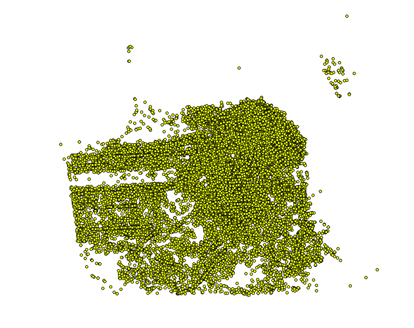

# go-whosonfirst-api

Go package for working with the [Who's On First (Mapzen Places) API](https://mapzen.com/documentation/places/).

## Install

You will need to have both `Go` (specifically a version of Go more recent than 1.6 so let's just assume you need [Go 1.8](https://golang.org/dl/) or higher) and the `make` programs installed on your computer. Assuming you do just type:

```
make bin
```

All of this package's dependencies are bundled with the code in the `vendor` directory.

## Usage

_Note that all error handling in the examples below has been removed for the sake of brevity._

### Simple

```
import (
	"github.com/whosonfirst/go-whosonfirst-api/client"
	"github.com/whosonfirst/go-whosonfirst-api/endpoint"
	"os"
)

api_key := "mapzen-xxxxxxx"
	
api_endpoint, _ := endpoint.NewMapzenAPIEndpoint(api_key)
api_client, _ := client.NewHTTPClient(api_endpoint)

method := "whosonfirst.places.search"
	
args := api_client.DefaultArgs()
args.Set("query", "poutine")
args.Set("placetype", "venue")	
	
rsp, _ := c.ExecuteMethod(method, args)
os.Stdout.Write(rsp.Raw())
```

### Paginated

```
import (
	"github.com/whosonfirst/go-whosonfirst-api/client"
	"github.com/whosonfirst/go-whosonfirst-api/endpoint"
	"os"
)

api_key := "mapzen-xxxxxxx"
	
api_endpoint, _ := endpoint.NewMapzenAPIEndpoint(api_key)
api_client, _ := client.NewHTTPClient(api_endpoint)

method := "whosonfirst.places.search"
	
args := api_client.DefaultArgs()
args.Set("query", "beer")
args.Set("placetype", "venue")
args.Set("locality_id", "101748417")

cb := func(rsp api.APIResponse) error {
	_, err := os.Stdout.Write(rsp.Raw())
	return err
}

c.ExecuteMethodPaginated(method, args, cb)
```

## Interfaces

Interfaces are still a bit of a moving target. Or more specifically existing interfaces that have been defined should not change but there also aren't interfaces for many types of WOF API responses. That's why the default `APIResponse` interface defines a `Raw()` that returns plain-vanilla bytes and leaves it as an exercise to consumers to figure out what to do with them.

While all of the interfaces still need to be documented properly the most important ones are:

```
type APIResponse interface {
	Raw() []byte
	String() string
	Ok() (bool, APIError)
	Pagination() (APIPagination, error)
	Places() ([]APIPlacesResult, error)
}

type APIPlacesResult interface {
	WOFId() int64
	WOFParentId() int64
	WOFName() string
	WOFPlacetype() string
	WOFCountry() string
	WOFRepo() string
	Path() string
	URI() string
	String(...APIResultFlag) string
}

type APIError interface {
	String() string
	Code() int64
	Message() string
}

type APIPagination interface {
	String() string
	Pages() int
	Page() int
	PerPage() int
	Total() int
	Cursor() string
	NextQuery() string
}
```

## Responses

Generally you shouldn't have to think about parsing formatted API responses. The `api.APIClient` interface requires that implementations define an `ExecuteMethod` method that returns a corresponding `api.APIResponse` thingy, like this:

```
type APIClient interface {
	ExecuteMethod(string, *url.Values) (APIResponse, error)
	DefaultArgs() *url.Values
}
```

And here's a snippet from the [client/http.go](https://github.com/whosonfirst/go-whosonfirst-api/blob/master/client/http.go) code:

```
var rsp api.APIResponse
var parse_err error

switch params.Get("format") {

case "":
	rsp, parse_err = response.ParseJSONResponse(http_rsp)
case "csv":
	rsp, parse_err = response.ParseCSVResponse(http_rsp)
case "json":
	rsp, parse_err = response.ParseJSONResponse(http_rsp)
case "meta":
	rsp, parse_err = response.ParseMetaResponse(http_rsp)
default:
	return nil, errors.New("Unsupported output format")
}
```

## Writers

"Writers" allow for API responses to be manipulated or output in a variety of formats. These interfaces should still be considered "wet paint" and works-in-progress if only because they have terrible names, like this:

```
type APIResultMultiWriter interface { // PLEASE RENAME ME...
	Write(APIPlacesResult) (int, error)
	Close()
}

type APIResultWriter interface {
	Write([]byte) (int, error)
	WriteString(string) (int, error)
	WriteResult(APIPlacesResult) (int, error)
	Close() error
}
```

As you can see from the interface above "writers" are currently targeted at API responses that can be massaged in to `api.APIPlacesResult` thingies.

### async

Like the `multi` writer the `async` writer begs the question: Is this a "writer" or something else? This is a container writer that allows you to define multiple writer targets for a single set of API results, where each response is processed concurrently. This can be useful when one of your writer targets is something like the `geojson` writer which needs to perform network requests.

### csv

This writer will generate a new CSV output where each row is the value of the `api.APIPlacesResult` 's `String()` method.

**Important** : As of this writing that means you'll need to explicitly ask the WOF API for CSV-formatted results by passing in `-param format=csv`. In the future, things might be a little more magical and elegant. Today they are not...

### geojson

This writer will go out over the network and fetch the source document (from [https://whosonfirst.mapzen.com/data](https://whosonfirst.mapzen.com/data)) for each API result and return a GeoJSON `FeatureCollection` (with all the results).

### multi

Is this a "writer" or something else? This is a container writer that allows you to define multiple writer targets for a single set of API results.

### stdout

This writer will format each API result and send it to STDOUT. Output is formatted as:

```
text := fmt.Sprintf("%d %s %s\n", r.WOFId(), r.WOFPlacetype(), r.WOFName())
```

### tts

This writer will format each API result and send it to a text-to-speech engine supported by the [go-writer-tts](https://github.com/whosonfirst/go-writer-tts) package (which still needs to be documented properly). Output is formatted as:

```
text := fmt.Sprintf("%s is a %s with Who's On First ID %d", r.WOFName(), r.WOFPlacetype(), r.WOFId())
```

## Tools

### wof-api

`wof-api` is a command line tool for calling the Who's On First API.

```
./bin/wof-api -h
Usage of ./bin/wof-api:
  -async
    	Process API results asynchronously. If true then any errors processing a response are reported by will not stop execution.
  -csv
    	Transform API results to source CSV for each API result.
  -csv-output string
    	The path to a file where CSV output should be written. Output is written to STDOUT if empty.
  -endpoint string
    	Define a custom endpoint for the Who's On First API.
  -filelist
    	Transform API results to a WOF "file list".
  -filelist-output string
    	The path to a file where WOF "file list"  output should be written. Output is written to STDOUT if empty.
  -filelist-prefix string
    	Prepend each WOF "file list" result with this prefix.
  -geojson
    	Transform API results to source GeoJSON for each API result, collating everything in to a single GeoJSON Feature Collection.
  -geojson-ls
    	Transform API results to line-separated source GeoJSON for each API result, with one GeoJSON Feature per line.
  -geojson-ls-output string
    	The path to a file where line-separated GeoJSON output should be written. Output is written to STDOUT if empty.
  -geojson-output string
    	The path to a file where GeoJSON output should be written. Output is written to STDOUT if empty.
  -paginated
    	Automatically paginate API results.
  -param value
    	One or more Who's On First API query=value parameters.
  -pretty
    	Pretty-print JSON results.
  -raw
    	Dump raw Who's On First API responses.
  -stdout
    	Write API results to STDOUT
  -timings
    	Track and report total time to invoke an API method. Timings are printed to STDOUT.
  -tts
    	Output integers to a text-to-speak engine.
  -tts-engine string
    	A valid go-writer-tts text-to-speak engine. Valid options are: osx, polly.
```

#### Example



Fetch all 63, 387 venues in [San Francisco](https://whosonfirst.mapzen.com/spelunker/id/85922583/) as a single GeoJSON `FeatureCollection` by calling the `whosonfirst.places.search` API method, like this:

```
./bin/wof-api -param method=whosonfirst.places.search -param locality_id=85922583 -param api_key=mapzen-XXXXXXX -param per_page=500 -param placetype=venue -paginated -geojson -geojson-output venues.geojson -timings -async
2017/03/03 17:29:11 Failed to retrieve https://whosonfirst.mapzen.com/data/110/880/049/3/1108800493.geojson because 404 Not Found
2017/03/03 17:29:11 Failed to retrieve https://whosonfirst.mapzen.com/data/110/880/049/1/1108800491.geojson because 404 Not Found
2017/03/03 17:29:11 Failed to retrieve https://whosonfirst.mapzen.com/data/110/882/755/7/1108827557.geojson because 404 Not Found
2017/03/03 17:30:09 Failed to retrieve https://whosonfirst.mapzen.com/data/236/676/137/236676137.geojson because 500 Internal Server Error
2017/03/03 17:31:17 time to 'whosonfirst.places.search': 5m22.656896289s
```

Here's what's going on:

* Fetch all the venues that are in [San Francisco](https://whosonfirst.mapzen.com/spelunker/id/85922583/) by passing the `-param placetype=venue` and `-param locality_id=85922583` flags, respectively.
* Do so in batches of 500 and handle pagination automatically by passing the `-param per_page=500` and `-paginated` flags respectively.
* For each result fetch the source GeoJSON file over the network, and do so asynchronously, creating a new `FeatureCollection` and save it as `venues.geojson` by passing the `-geojson`, `-async` and `-output venues.geojson` flags, respectively.
* Print how long the whole thing takes by passing the `-timings` flag.

You could also do the same by calling the `whosonfirst.places.getDescendants` API method, like this:

```
./bin/wof-api -param method=whosonfirst.places.getDescendants -param id=85922583 -param api_key=mapzen-XXXXXX -param per_page=500 -param placetype=venue -paginated -geojson -output descendants.geojson -timings -async
2017/03/03 17:56:14 Failed to retrieve https://whosonfirst.mapzen.com/data/110/880/049/1/1108800491.geojson because 404 Not Found
2017/03/03 17:56:14 Failed to retrieve https://whosonfirst.mapzen.com/data/110/880/049/3/1108800493.geojson because 404 Not Found
2017/03/03 17:56:14 Failed to retrieve https://whosonfirst.mapzen.com/data/110/882/755/7/1108827557.geojson because 404 Not Found
2017/03/03 17:56:15 time to 'whosonfirst.places.getDescendants': 5m16.811679531s
```

If you're wondering about the `-geojson` flag it's useful because the Who's On First API returns a minimum subset of a record's properties by default and does not return geometries at all (at least not yet). For example, here's what a default API response for a place looks like:

```
{
	"wof:id": 202863435,
	"wof:parent_id": "85887433",
	"wof:name": "18th Ave Photo",
	"wof:placetype": "venue",
	"wof:country": "US",
	"wof:repo": "whosonfirst-data-venue-us-ca"
}
```																					

The `-geojson` flag will instruct the `wof-api` tool to determine the fully qualified URL for a record – for example `202863435` becomes `https://whosonfirst.mapzen.com/data/202/863/435/202863435.geojson` – and then fetch [the contents of that file](https://whosonfirst.mapzen.com/data/202/863/435/202863435.geojson) and use that (rather than the default response above) in your final output.

## See also

* https://mapzen.com/documentation/places/
* https://github.com/whosonfirst/go-whosonfirst-utils#wof-geojsonls-dump
* https://github.com/whosonfirst/go-whosonfirst-utils#wof-geojsonls-validate
